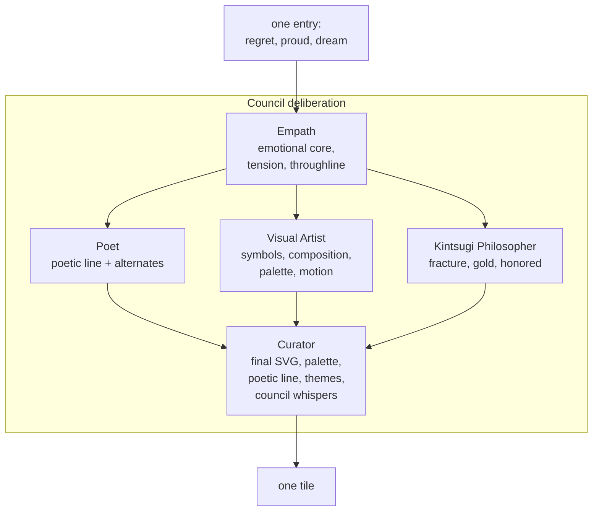

# Kintsugi Network

An interactive art installation that transforms human vulnerability into collective beauty.

Each visitor submits three things — their biggest regret, proudest moment, and unfinished dream. A Council of five Claude personas (Empath, Poet, Visual Artist, Kintsugi Philosopher, Curator) deliberates on each entry before a unique SVG tile is born. The tiles form a living mosaic, held together by glowing gold seams in the spirit of Japanese Kintsugi — the art of repairing broken pottery with gold, honoring the fracture rather than hiding it.

> _"each fragment, a person. together, a whole."_

---

## What you need

- **Node.js 20+** and **npm**.
- An **Anthropic API key** from [console.anthropic.com](https://console.anthropic.com).
- A CSV of entries (instructions below).

Note: this project does not use any image-generation API. Claude itself produces the SVG artwork directly, so the only API cost is Claude API usage. Roughly $0.15–0.25 per tile on Sonnet 4.5.

---

## Setup

```bash
npm install
cp .env.example .env.local
```

Open `.env.local` and paste your key:

```
ANTHROPIC_API_KEY=sk-ant-…
```

---

## Adding entries

Open [`data/entries.csv`](data/entries.csv) and add rows. The columns are:

| column | required | notes |
|--------|----------|-------|
| `name` | optional | Can be anonymized or left blank. Never shown in the mosaic. |
| `regret` | required | "The biggest regret you're willing to share." |
| `proud` | required | "A moment you are proudest of." |
| `dream` | required | "Something you've started and haven't finished." |

A sample CSV with five composite entries is provided. Replace it with exports from your own spreadsheet (Google Sheets → File → Download → Comma-separated values).

---

## Running the Council

Generate tiles from the CSV:

```bash
npm run generate
```

This runs the five-voice Council deliberation once per entry and writes:

- `public/tiles/<id>.svg` — the rendered SVG
- `data/tiles.json` — tile metadata (poetic line, themes, council whispers)
- `data/deliberations/<id>.json` — the full transcript of what each persona said

The script is **idempotent and resumable**:

- Re-running skips any entry whose content hash matches a tile that already exists.
- Each tile is written atomically before the next one is attempted, so you can safely `Ctrl-C` mid-batch.
- Adding a row to the CSV and re-running will only generate the new tile.

Then build the gold threads between tiles:

```bash
npm run connect
```

This runs the **Weaver** (proposes candidate connections based on themes, poetic lines, and the Empath's throughlines) and the **Critic** (rejects weak or surface-level matches). Only resonant connections survive into `data/connections.json`.

You can re-run `connect` any time the set of tiles changes.

Start the mosaic:

```bash
npm run dev
```

Open [http://localhost:3000](http://localhost:3000) and watch the gold breathe.

---

## How the Council works



1. **The Empath** listens first and names the emotional core, the tension, and the throughline — only what the person's exact words carry.
2. **The Poet, Visual Artist, and Kintsugi Philosopher** each receive the Empath's reading and respond in parallel. None of them writes the tile; each contributes a different layer.
3. **The Curator** synthesizes everything into the final tile — a complete SVG, a refined poetic line, a final palette, themes, and a one-line whisper from each of the five voices.

Clicking a tile in the mosaic opens a modal with the person's three statements, the poetic line, one gold-thread connection to another tile, and an expandable "The Council said…" section where visitors who want depth can read the whispers.

See [`docs/council-review.md`](docs/council-review.md) for the Claude Code subagent critique pass that shaped the current prompts.

---

## File layout

```
.
├── app/                       # Next.js App Router
│   ├── layout.tsx             # fonts, metadata
│   ├── globals.css            # color palette, animations
│   ├── page.tsx               # loads tiles + SVGs at request time
│   └── components/
│       ├── Mosaic.tsx         # grid + state
│       ├── Tile.tsx           # one tile (SVG + breathing)
│       ├── GoldSeams.tsx      # glowing gold seams in the grid gaps
│       ├── StoryModal.tsx     # story + connection + council whispers
│       └── EmptyState.tsx     # shown when no tiles yet
├── lib/
│   ├── claude.ts              # Anthropic client + structured output helper
│   ├── zodToJsonSchema.ts     # minimal Zod → JSON Schema converter
│   ├── grid.ts                # near-square grid dimensions
│   ├── types.ts               # shared TS types
│   └── council/
│       ├── personas.ts        # five system prompts
│       ├── empath.ts          # one file per persona
│       ├── poet.ts
│       ├── visualArtist.ts
│       ├── kintsugiPhilosopher.ts
│       ├── curator.ts         # + SVG safety validator
│       ├── orchestrator.ts    # runs the full deliberation per entry
│       └── weaver.ts          # Weaver + Critic for connections
├── scripts/
│   ├── generate.ts            # CSV → Council → tiles (npm run generate)
│   └── connect.ts             # Weaver + Critic → connections (npm run connect)
├── data/
│   ├── entries.csv            # your spreadsheet export
│   ├── tiles.json             # generated
│   ├── connections.json       # generated
│   └── deliberations/         # generated — full transcripts
├── public/tiles/              # generated SVGs
├── docs/council-review.md     # subagent critique log
└── .env.local                 # your ANTHROPIC_API_KEY
```

---

## Cost

Per entry, a full Council deliberation is:

- 1 Empath call (advisor model, ~400 output tokens)
- 1 Poet call (advisor model, ~250 output tokens)
- 1 Visual Artist call (advisor model, ~400 output tokens)
- 1 Kintsugi Philosopher call (advisor model, ~400 output tokens)
- 1 Curator call (Sonnet, ~2500 output tokens — mostly SVG)

On Claude Sonnet 4.5, expect roughly **$0.15–0.25 per tile**. Fifty tiles sits around **$8–12**, plus a few more dollars for the Weaver + Critic pass on the whole set.

To cut cost, set `KINTSUGI_USE_HAIKU_FOR_ADVISORS=true` in `.env.local`. The four advisor personas will run on Haiku 4.5 while the Curator stays on Sonnet for the final synthesis and SVG. This drops cost to roughly **$0.05–0.08 per tile** and is a reasonable default for large batches.

---

## Deploying

This is a standard Next.js 16 app.

For Vercel:

```bash
npx vercel
```

Set `ANTHROPIC_API_KEY` in the Vercel project's environment variables. Generation is offline (run locally, then commit `data/tiles.json`, `public/tiles/`, and `data/connections.json` with the `.gitignore` lines temporarily removed — see comments in [`.gitignore`](.gitignore)). The deployed site does not make any Claude API calls at runtime; it just reads the generated files.

---

## Philosophy

This installation believes three things:

1. A tile is not an illustration of what happened to someone. It is a trace of what remains.
2. The broken place is where the gold belongs. A good tile does not make the regret pretty.
3. Alone, each fragment is a person. Together, they are a whole. The mosaic exists to make that visible.

The Council exists because no single voice can hold all of that at once. A single Claude call might produce a beautiful image, but it would collapse empathy, poetry, composition, and philosophy into one gesture. The deliberation is the piece.
